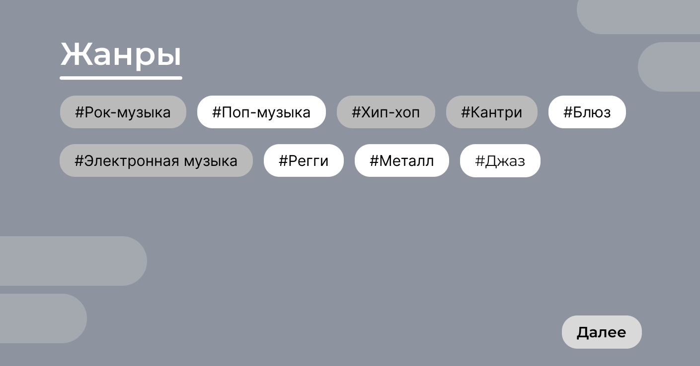
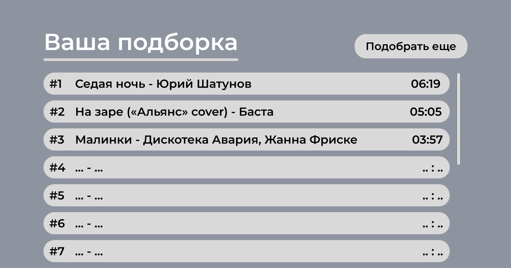

# Разработка программы для составления музыкальных рекомендаций контента пользователю

## Описание

Данный проект представляет собой систему рекомендаций, которая помогает пользователям находить наиболее релевантный контент на основе их предпочтений и поведения. Система использует современные алгоритмы машинного обучения и обработки данных для анализа взаимодействий пользователей с контентом и создания персонализированных рекомендаций. Программа ориентирована на улучшение пользовательского опыта и повышение вовлеченности за счет точных и индивидуальных предложений контента.

## Авторы

- [Александра Бондаренко](https://github.com/sashalieb)
- [Дмитрий Зебзеев](https://github.com/TsaferT)
- [Кирилл Сексяев](https://github.com/sexyaev)

## Макет дизайна сайта 🎵

### 1. Главная страница
На главной странице пользователю предлагается начать подбор музыки.

  

### 2. Выбор жанров и исполнителей
Далее пользователю предоставляется возможность выбрать интересующие его жанры и любимых исполнителей, чтобы подборка была максимально точной.

  

  

### 3. Готовая подборка
После выбора всех предпочтений пользователь получает свою уникальную подборку музыки, созданную специально для него.

  

